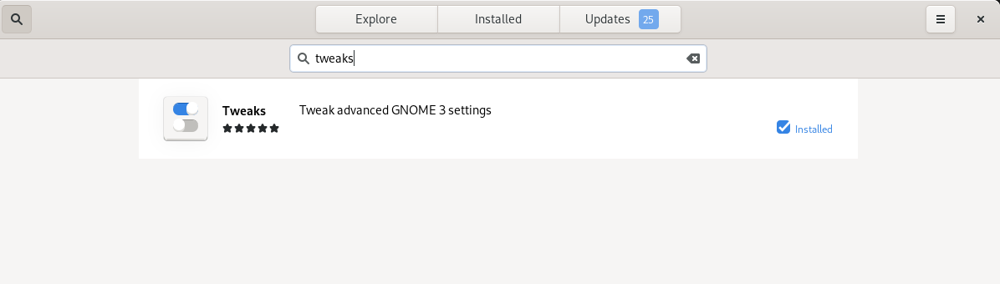
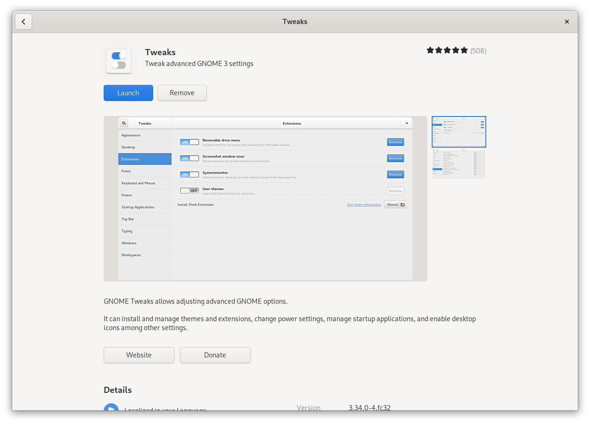
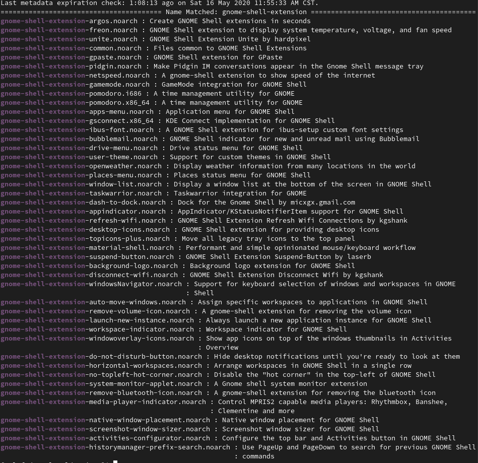
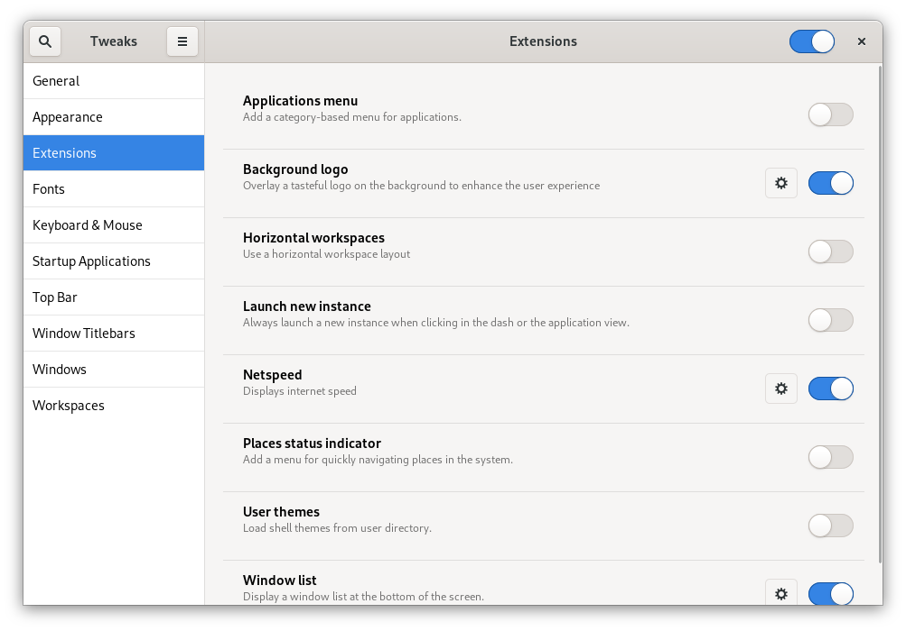

# Gnome Extension Manager *Tweaks*
 
## 1.Search *Tweaks* in *software*



## 2.Download *Tweaks* in *software*

 

## 3.Download *gnome-shell-extension* through *dnf*

 ```
 sudo dnf check-update
 sudo dnf search "gnome-shell-extension"
 ```

 Install any Extension what you like use `sudo dnf install xxxxx`, such as *netspeed*.

 

:warning: Remember run `reboot` before managing these Extensions installed.

## 4.Manage *Extensions*


